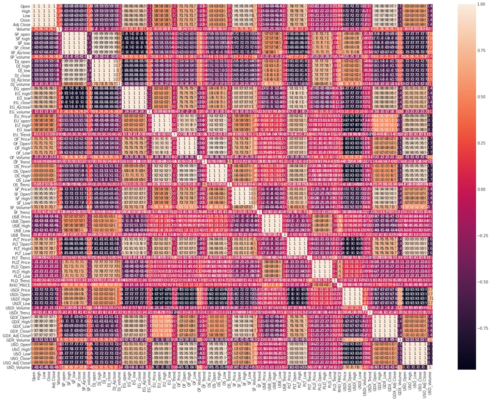
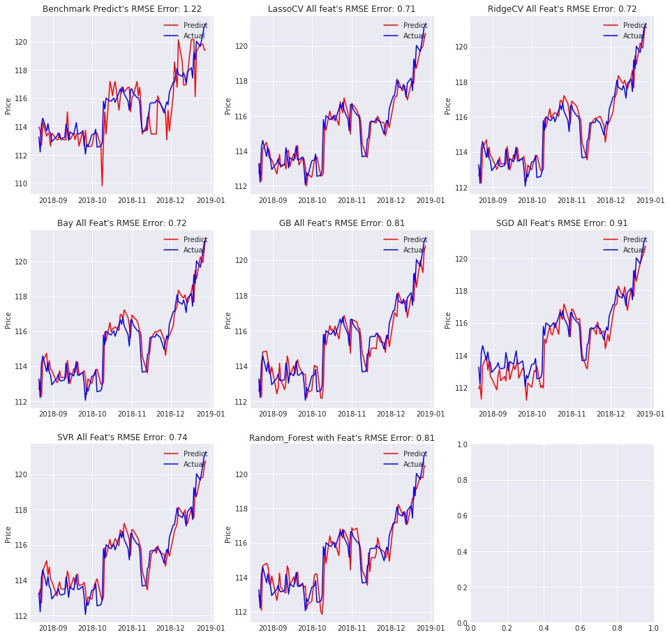
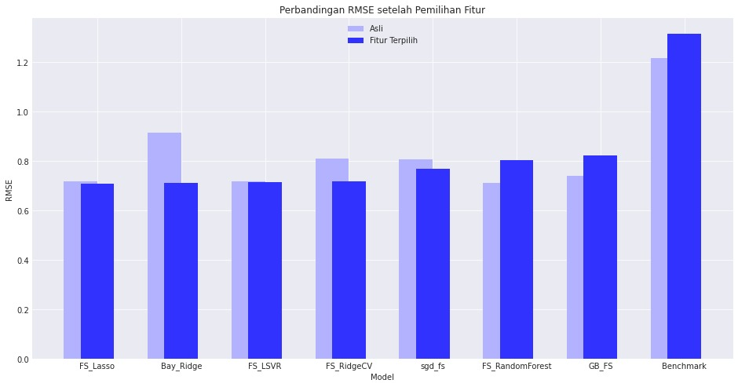
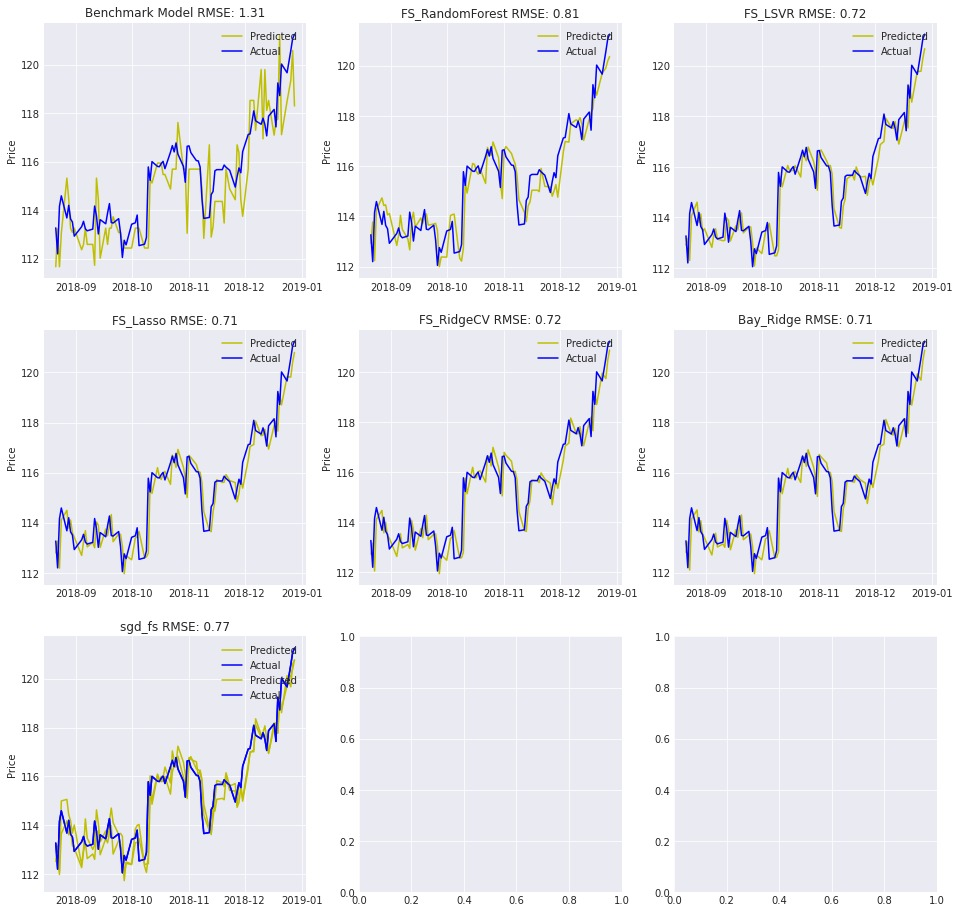

# Laporan Proyek Machine Learning - T. Muhammad Caesar Maulana

## Domain Proyek

Emas telah lama digunakan sebagai alat tukar dan simbol kekayaan di berbagai belahan dunia. Saat ini, emas memiliki peran penting dalam ekonomi global, terutama sebagai aset lindung nilai terhadap inflasi dan ketidakstabilan pasar. Bank sentral banyak negara menyimpan emas sebagai cadangan devisa untuk menjamin stabilitas ekonomi dan kepercayaan pasar.

Fluktuasi harga emas dipengaruhi oleh berbagai faktor seperti nilai tukar mata uang, inflasi, suku bunga, dan kondisi geopolitik. Oleh karena itu, melakukan prediksi terhadap pergerakan harga emas dapat membantu investor dan pembuat kebijakan dalam mengambil keputusan yang lebih tepat.

**Referensi**:
- [Inflation Responses to Commodity Price Shocks–How and Why Do Countries Differ?](https://www.imf.org/external/pubs/ft/wp/2012/wp12225.pdf)
- [Sejarah dan Peran Emas: Dari Simbol Kekayaan Kuno hingga Investasi Modern - Galeri 24](https://galeri24.co.id/post/sejarah-dan-peran-emas-dari-simbol-kekayaan-kuno-hingga-investasi-modern)
- [5 Peran Emas dalam Perencanaan Keuangan Jangka Panjang - Treasury](https://www.treasury.id/5-peran-emas-dalam-perencanaan-keuangan-jangka-panjang)
- [Emas dan Ekonomi Global: Hubungan yang Kompleks - Blog IndoGold](https://blog.indogold.id/emas-dan-ekonomi-global-hubungan-yang-kompleks/)
- [Fungsi Emas Sebagai Aset Lindung Nilai - Bareksa.com](https://www.bareksa.com/berita/reksa-dana/2020-09-07/fungsi-emas-sebagai-aset-lindung-nilai)

---

## Business Understanding

### Problem Statements
1. Bagaimana faktor-faktor ekonomi seperti harga minyak, indeks saham, dan nilai tukar mata uang mempengaruhi harga emas?
2. Bagaimana membangun model prediksi harga emas yang akurat menggunakan teknik machine learning?
3. Fitur-fitur apa yang paling signifikan dalam memprediksi harga emas?

### Goals
1. Menganalisis pengaruh faktor-faktor ekonomi terhadap harga emas.
2. Membangun model prediksi harga emas yang akurat menggunakan berbagai algoritma machine learning.
3. Mengidentifikasi fitur-fitur yang paling berpengaruh dalam prediksi harga emas.

### Solution Statements
1. Menggunakan algoritma regresi seperti Linear SVR, Lasso, Ridge, dan Bayesian Ridge untuk memprediksi harga emas.
2. Melakukan tuning hyperparameter untuk meningkatkan performa model.
3. Menggunakan teknik seleksi fitur untuk mengidentifikasi fitur yang paling signifikan.

---

## Data Understanding

Dataset yang digunakan dalam proyek ini diperoleh dari [Kaggle Gold Price Prediction Dataset](https://www.kaggle.com/datasets/sid321axn/gold-price-prediction-dataset). Dataset ini mencakup data historis harga emas dan berbagai faktor ekonomi yang mempengaruhinya, seperti harga minyak, indeks saham, dan nilai tukar mata uang.

Data dalam penelitian ini dikumpulkan dari berbagai sumber dalam rentang waktu **18 November 2011** hingga **1 Januari 2019**. Dataset ini memiliki **1718 baris** dan **80 kolom**, yang terdiri dari berbagai atribut ekonomi dan keuangan yang berpengaruh terhadap harga emas.

Fitur yang dikumpulkan mencakup berbagai faktor ekonomi seperti **harga minyak mentah, indeks saham (S&P 500 dan Dow Jones), nilai tukar mata uang Euro-USD, harga logam mulia lainnya (Perak, Platinum, Palladium, Rhodium), indeks dolar AS, serta data dari Gold Miners ETF dan Eldorado Gold Corporation**.

### Variabel-variabel pada Dataset:
- **Open, High, Low, Close, Adj Close**: Harga pembukaan, tertinggi, terendah, penutupan, dan penutupan yang disesuaikan untuk emas.
- **Volume**: Volume perdagangan emas.
- **SP_open, SP_high, SP_low, SP_close, SP_Ajclose**: Harga pembukaan, tertinggi, terendah, penutupan, dan penutupan yang disesuaikan untuk indeks S&P 500.
- **DJ_open, DJ_high, DJ_low, DJ_close, DJ_Ajclose**: Harga pembukaan, tertinggi, terendah, penutupan, dan penutupan yang disesuaikan untuk indeks Dow Jones.
- **EU_Price, EU_open, EU_high, EU_low**: Harga dan nilai tukar Euro-USD.
- **OF_Price, OF_Open, OF_High, OF_Low**: Harga minyak mentah Brent.
- **SF_Price, SF_Open, SF_High, SF_Low**: Harga futures perak.
- **USB_Price, USB_Open, USB_High, USB_Low**: Harga obligasi US 10 tahun.
- **PLT_Price, PLT_Open, PLT_High, PLT_Low**: Harga platinum.
- **PLD_Price, PLD_Open, PLD_High, PLD_Low**: Harga palladium.
- **RHO_PRICE**: Harga rhodium.
- **USDI_Price, USDI_Open, USDI_High, USDI_Low**: Indeks dolar AS.
- **GDX_Open, GDX_High, GDX_Low, GDX_Close, GDX_Adj Close**: Harga ETF penambang emas.
- **USO_Open, USO_High, USO_Low, USO_Close, USO_Adj Close**: Harga ETF minyak.


---

## Data Preparation

Tahap **Data Preparation** adalah salah satu tahap kritis dalam proyek machine learning. Pada tahap ini, data yang telah dikumpulkan diproses dan disiapkan agar siap digunakan untuk pemodelan. Berikut adalah penjelasan lengkap tentang tahap **Data Preparation** yang dilakukan dalam proyek ini:

### 1. Pengumpulan Data

### **Sumber Data**
Dataset diperoleh dari [Kaggle Gold Price Prediction Dataset](https://www.kaggle.com/datasets/sid321axn/gold-price-prediction-dataset).

#### **Karakteristik Data**
Dataset mencakup data historis harga emas dan berbagai faktor ekonomi yang mempengaruhinya, seperti harga minyak, indeks saham, dan nilai tukar mata uang. Dataset ini memiliki **1718 baris** dan **80 kolom**.

#### **Rentang Waktu**
Data dikumpulkan dari **18 November 2011** hingga **1 Januari 2019**.

#### **Alasan Pengumpulan Data**
Pengumpulan data dari sumber yang kredibel dan komprehensif memastikan bahwa data yang digunakan memiliki kualitas yang baik dan relevan dengan masalah yang ingin diselesaikan.

```python
import pandas as pd

# Memuat dataset
df = pd.read_csv("/kaggle/input/gold-price-prediction-dataset/FINAL_USO.csv")
```

### 2. Eksplorasi Data (EDA)

### **Pemeriksaan Nilai yang Hilang**
Sebelum melanjutkan, penting untuk memeriksa apakah ada nilai yang hilang dalam dataset.

```python
# Memeriksa nilai yang hilang
df.isnull().values.any()  # Output: False
```

#### **Analisis Korelasi**
Menggunakan heatmap untuk memvisualisasikan korelasi antar fitur.

```python
import seaborn as sns
import matplotlib.pyplot as plt

# Membuat heatmap korelasi
plt.figure(figsize=(24, 18))
sns.heatmap(df.corr(), annot=True)
plt.show()
```



### 3. Preprocessing Data

#### **Normalisasi Data**
Menggunakan MinMaxScaler untuk menormalisasi fitur-fitur dalam dataset ke rentang antara 0 dan 1.

```python
from sklearn.preprocessing import MinMaxScaler

# Inisialisasi MinMaxScaler
scaler = MinMaxScaler()

# Normalisasi fitur
feature_minmax_transform_data = scaler.fit_transform(df[feature_columns])
```

#### **Penghitungan Indikator Teknikal**
Menghitung indikator teknikal seperti MACD, RSI, dan Bollinger Bands untuk menambahkan fitur baru.

```python
# Menghitung MACD
def calculate_MACD(df, nslow=26, nfast=12):
    emaslow = df.ewm(span=nslow, min_periods=nslow, adjust=True, ignore_na=False).mean()
    emafast = df.ewm(span=nfast, min_periods=nfast, adjust=True, ignore_na=False).mean()
    dif = emafast - emaslow
    MACD = dif.ewm(span=9, min_periods=9, adjust=True, ignore_na=False).mean()
    return dif, MACD
```

### 4. Pemilihan Fitur

### **Analisis Korelasi**
Menggunakan matriks korelasi untuk mengidentifikasi fitur-fitur yang memiliki korelasi tinggi dengan target (harga emas).

```python
# Menghitung korelasi fitur dengan target
corr_matrix = df.corr()
coef = corr_matrix["Adj Close"].sort_values(ascending=False)
```

#### **Seleksi Fitur**
Menggunakan Lasso Regression untuk memilih fitur yang paling signifikan.

```python
from sklearn.linear_model import Lasso
from sklearn.feature_selection import SelectFromModel

# Seleksi fitur dengan Lasso
lasso = Lasso(alpha=0.01)
feature_sel_model = SelectFromModel(lasso)
feature_sel_model.fit(X_train, y_train)
```

### 5. Pembagian Data

### **Pembagian Data Pelatihan dan Validasi**
Data dibagi menjadi data pelatihan dan data validasi. Data validasi menggunakan 90 baris terakhir dari dataset.

```python
# Membuat set validasi
validation_X = feature_minmax_transform[-90:-1]
validation_y = target_adj_close[-90:-1]
```

#### **TimeSeriesSplit**
Menggunakan TimeSeriesSplit untuk membagi data deret waktu menjadi beberapa fold.

```python
from sklearn.model_selection import TimeSeriesSplit

# Inisialisasi TimeSeriesSplit
tscv = TimeSeriesSplit(n_splits=5)
```

### **Ringkasan Tahap Data Preparation**
Tahap Data Preparation meliputi:

1. **Pengumpulan Data**: Memastikan data berasal dari sumber yang kredibel.
2. **Eksplorasi Data**: Memahami pola dan hubungan antar fitur.
3. **Preprocessing Data**: Normalisasi, penanganan missing values, dan transformasi fitur.
4. **Pemilihan Fitur**: Menggunakan analisis korelasi dan seleksi fitur untuk memilih fitur yang paling signifikan.
5. **Pembagian Data**: Membagi data menjadi data pelatihan dan validasi dengan menjaga urutan waktu.

#### **Alasan Data Preparation**
Tahap ini diperlukan untuk memastikan bahwa:
- Data siap digunakan untuk pemodelan,
- Meningkatkan kualitas data,
- Mengurangi risiko overfitting atau underfitting pada model.


## Modeling

### Algoritma yang Digunakan:
1. **Decision Tree Regressor**: Digunakan sebagai model benchmark untuk membandingkan performa model yang lebih kompleks.
2. **Support Vector Regressor (SVR)**: Dengan kernel linear dan tuning hyperparameter untuk meningkatkan performa prediksi.
3. **Random Forest Regressor**: Digunakan untuk membandingkan performa dengan model lain, dengan tuning hyperparameter untuk optimasi.
4. **Lasso dan Ridge Regression**: Digunakan untuk regularisasi dan mencegah overfitting, dengan cross-validation untuk memilih parameter terbaik.
5. **Bayesian Ridge Regression**: Digunakan untuk estimasi distribusi parameter model, memberikan insight lebih dalam tentang ketidakpastian model.
6. **Gradient Boosting Regressor**: Digunakan untuk meningkatkan akurasi prediksi dengan menggabungkan banyak model pohon keputusan.
7. **Stochastic Gradient Descent (SGD)**: Digunakan untuk optimisasi pada dataset besar dengan iterasi acak.

### Tahapan dan Parameter yang Digunakan:

#### 1. Decision Tree Regressor
- **Parameter Default**: Digunakan sebagai baseline.
- **Validasi**: Menghitung RMSE dan R².

```python
# Membuat dan melatih model Decision Tree
dt = DecisionTreeRegressor(random_state=0)
benchmark_dt = dt.fit(X_train, y_train)

# Validasi hasil prediksi
validate_result(benchmark_dt, 'Decision Tree Regression')
```

#### 2. Support Vector Regressor (SVR)
- **Kernel**: Linear.
- **Tuning Hyperparameter**: Menggunakan GridSearchCV untuk mencari kombinasi terbaik dari C dan epsilon.

```python
# Tuning hyperparameter SVR
linear_svr_parameters = {
    'C': [0.5, 1.0, 10.0, 50.0],
    'epsilon': [0, 0.1, 0.5, 0.7, 0.9],
}

lsvr_grid_search_feat = GridSearchCV(
    estimator=linear_svr_clf_feat,
    param_grid=linear_svr_parameters,
    cv=ts_split,
)
lsvr_grid_search_feat.fit(X_train, y_train)

# Validasi hasil prediksi
validate_result(lsvr_grid_search_feat, 'Linear SVR GS All Feat')
```

#### 3. Random Forest Regressor
- **Tuning Hyperparameter**: Menggunakan GridSearchCV untuk mencari kombinasi terbaik dari n_estimators, max_features, dan max_depth.

```python
# Tuning hyperparameter Random Forest
random_forest_parameters = {
    'n_estimators': [10, 15, 20, 50, 100],
    'max_features': ['auto', 'sqrt', 'log2'],
    'max_depth': [2, 3, 5, 7, 10],
}

grid_search_RF_feat = GridSearchCV(
    estimator=random_forest_clf_feat,
    param_grid=random_forest_parameters,
    cv=ts_split,
)
grid_search_RF_feat.fit(X_train, y_train)

# Validasi hasil prediksi
validate_result(grid_search_RF_feat, 'RandomForest GS')
```

#### 4. Lasso dan Ridge Regression
- **Lasso**: Menggunakan regularisasi L1.
- **Ridge**: Menggunakan regularisasi L2.
- **Cross-Validation**: Digunakan untuk memilih parameter terbaik.

```python
# Lasso Regression dengan Cross-Validation
lasso_clf = LassoCV(n_alphas=1000, max_iter=3000, random_state=0)
lasso_clf_feat = lasso_clf.fit(X_train, y_train)
validate_result(lasso_clf_feat, 'LassoCV')

# Ridge Regression dengan Cross-Validation
ridge_clf = RidgeCV(gcv_mode='auto')
ridge_clf_feat = ridge_clf.fit(X_train, y_train)
validate_result(ridge_clf_feat, 'RidgeCV')
```

#### 5. Bayesian Ridge Regression
- **Pendekatan Bayesian**: Menaksir distribusi parameter model.

```python
# Bayesian Ridge Regression
bay = linear_model.BayesianRidge()
bay_feat = bay.fit(X_train, y_train)
validate_result(bay_feat, 'Bayesian')
```

#### 6. Gradient Boosting Regressor
- **Parameter**: n_estimators=70, learning_rate=0.1, max_depth=4.

```python
# Gradient Boosting Regressor
regr = GradientBoostingRegressor(
    n_estimators=70, learning_rate=0.1, max_depth=4, random_state=0, loss='ls'
)
GB_feat = regr.fit(X_train, y_train)
validate_result(GB_feat, 'Gradient Boosting')
```

#### 7. Stochastic Gradient Descent (SGD)
- **Parameter**: max_iter=1000, tol=1e-3, loss='squared_epsilon_insensitive'.

```python
# Stochastic Gradient Descent
sgd = SGDRegressor(
    max_iter=1000, tol=1e-3, loss='squared_epsilon_insensitive', penalty='l1', alpha=0.1
)
sgd_feat = sgd.fit(X_train, y_train)
validate_result(sgd_feat, 'SGD')
```

### Kelebihan dan Kekurangan Algoritma:

| Algoritma | Kelebihan | Kekurangan |
|-----------|-----------|-----------|
| Decision Tree | Mudah diinterpretasi, tidak memerlukan normalisasi data. | Rentan terhadap overfitting, terutama pada dataset besar. |
| SVR | Efektif untuk dataset kecil, dapat menangani data non-linear. | Memerlukan tuning hyperparameter, komputasi mahal untuk dataset besar. |
| Random Forest | Robust terhadap overfitting, dapat menangani banyak fitur. | Memerlukan waktu komputasi lebih lama, kurang interpretatif. |
| Lasso dan Ridge | Efektif untuk regularisasi, mencegah overfitting. | Memerlukan tuning parameter, Lasso dapat menghasilkan koefisien nol. |
| Bayesian Ridge | Memberikan estimasi distribusi parameter, berguna untuk analisis ketidakpastian. | Komputasi intensif, terutama untuk dataset besar. |
| Gradient Boosting | Akurat, dapat menangani data non-linear. | Memerlukan tuning hyperparameter, komputasi mahal. |
| SGD | Efisien untuk dataset besar, dapat digunakan dengan berbagai fungsi kerugian. | Sensitif terhadap scaling data, memerlukan tuning parameter. |


### Improvement Model:

- **Tuning Hyperparameter**:
  - Menggunakan GridSearchCV untuk mencari kombinasi hyperparameter terbaik pada model SVR dan Random Forest.
  - Parameter yang di-tuning termasuk C, epsilon untuk SVR, dan n_estimators, max_features, max_depth untuk Random Forest.

- **Seleksi Fitur**:
  - Menggunakan SelectFromModel dengan Lasso untuk memilih fitur yang paling signifikan.
  - Fitur yang dipilih digunakan untuk melatih model dan meningkatkan performa prediksi.

```python
# Seleksi Fitur dengan Lasso
sfm = SelectFromModel(lasso_clf_feat)
sfm.fit(feature_minmax_transform, target_adj_close.values.ravel())
feature_selected = feature_minmax_transform[sfm.get_support()]
```

- **Pemilihan Model Terbaik**:
  - **Lasso Regression** dipilih sebagai model terbaik karena memberikan nilai RMSE terendah (0.709) dan R² tertinggi (0.884) pada data validasi.
  - **Alasan Pemilihan**: Lasso menunjukkan performa yang konsisten baik pada data training maupun validasi, serta mampu mengurangi overfitting dengan regularisasi L1.

---

## Evaluation

### Metrik Evaluasi:
- **RMSE (Root Mean Squared Error)**: Mengukur perbedaan antara nilai prediksi dan aktual. Formula RMSE:
  
  $$ RMSE = \sqrt{\frac{1}{n} \sum_{i=1}^{n} (y_i - \hat{y}_i)^2} $$

- **R² (Coefficient of Determination)**: Mengukur seberapa baik model menjelaskan variansi dalam data. Formula R²:

  $$ R^2 = 1 - \frac{\sum_{i=1}^{n} (y_i - \hat{y}_i)^2}{\sum_{i=1}^{n} (y_i - \bar{y})^2} $$

### Hasil Evaluasi:
- **Decision Tree**:
  - **RMSE**: 1.2166871700124942
  - **R² Score**: 0.6590361406118342
- **Linear SVR**:
  - **RMSE**: 0.8136915781869215
  - **R² Score**: 0.8474998982807777
- **Random Forest**:
  - **RMSE**: 0.8078828885891266
  - **R² Score**: 0.8496694277726002
- **Lasso**:
  - **RMSE**: 0.7117047240324116
  - **R² Score**: 0.8833324203076942
- **Ridge**:
  - **RMSE**: 0.7186272523103391
  - **R² Score**: 0.8810518047764179
- **Bayesian Ridge**:
  - **RMSE**: 0.7195639601669016
  - **R² Score**: 0.8807415122717521
- **Gradient Boosting**:
  - **RMSE**: 0.8094931831292806
  - **R² Score**: 0.8490695443986875
- **SGD**:
  - **RMSE**: 0.9141489449988743
  - **R² Score**: 0.8075205291328325
- **Ensemble Model**:
  - **RMSE**: 0.7007271848703037
  - **R² Score**: 0.8869036929493133

### Hasil Prediksi Sebelum Feature Selection
Berikut adalah grafik hasil prediksi dari model sebelum dilakukan seleksi fitur:



### Perbandingan RMSE Sebelum Feature Selection
Berikut adalah grafik perbandingan RMSE dari model-model sebelum dilakukan seleksi fitur:



### Hasil Prediksi Setelah Feature Selection
Berikut adalah grafik hasil prediksi dari model setelah dilakukan seleksi fitur:



### Perbandingan RMSE Setelah Feature Selection
Berikut adalah grafik perbandingan RMSE dari model-model setelah dilakukan seleksi fitur:


### Kesimpulan:
- **Model Terbaik**: **Ensemble Model** dengan kombinasi Lasso, Bayesian Ridge, dan Ridge menunjukkan performa terbaik dengan **RMSE 0.70** dan **R² Score 0.886**.
- **Model dengan Fitur Terpilih**: **Lasso** dengan fitur terpilih menunjukkan performa yang sangat baik dengan **RMSE 0.709** dan **R² Score 0.884**.
- **Rekomendasi**: **Ensemble Model** dan **Lasso** dengan fitur terpilih dapat digunakan sebagai solusi terbaik untuk prediksi harga emas.

---
