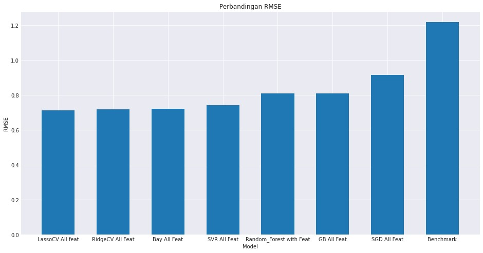

# Laporan Proyek Machine Learning - T. Muhammad Caesar Maulana

## Domain Proyek

Emas telah lama digunakan sebagai alat tukar dan simbol kekayaan di berbagai belahan dunia. Saat ini, emas memiliki peran penting dalam ekonomi global, terutama sebagai aset lindung nilai terhadap inflasi dan ketidakstabilan pasar. Bank sentral banyak negara menyimpan emas sebagai cadangan devisa untuk menjamin stabilitas ekonomi dan kepercayaan pasar.

Fluktuasi harga emas dipengaruhi oleh berbagai faktor seperti nilai tukar mata uang, inflasi, suku bunga, dan kondisi geopolitik. Oleh karena itu, melakukan prediksi terhadap pergerakan harga emas dapat membantu investor dan pembuat kebijakan dalam mengambil keputusan yang lebih tepat.

**Referensi**:
- [Inflation Responses to Commodity Price Shocks–How and Why Do Countries Differ?](https://www.imf.org/external/pubs/ft/wp/2012/wp12225.pdf)
- [Sejarah dan Peran Emas: Dari Simbol Kekayaan Kuno hingga Investasi Modern - Galeri 24](https://galeri24.co.id/post/sejarah-dan-peran-emas-dari-simbol-kekayaan-kuno-hingga-investasi-modern)
- [5 Peran Emas dalam Perencanaan Keuangan Jangka Panjang - Treasury](https://www.treasury.id/5-peran-emas-dalam-perencanaan-keuangan-jangka-panjang)
- [Emas dan Ekonomi Global: Hubungan yang Kompleks - Blog IndoGold](https://blog.indogold.id/emas-dan-ekonomi-global-hubungan-yang-kompleks/)
- [Fungsi Emas Sebagai Aset Lindung Nilai - Bareksa.com](https://www.bareksa.com/berita/reksa-dana/2020-09-07/fungsi-emas-sebagai-aset-lindung-nilai)

---

## Business Understanding

### Problem Statements
1. Bagaimana faktor-faktor ekonomi seperti harga minyak, indeks saham, dan nilai tukar mata uang mempengaruhi harga emas?
2. Bagaimana membangun model prediksi harga emas yang akurat menggunakan teknik machine learning?
3. Fitur-fitur apa yang paling signifikan dalam memprediksi harga emas?

### Goals
1. Menganalisis pengaruh faktor-faktor ekonomi terhadap harga emas.
2. Membangun model prediksi harga emas yang akurat menggunakan berbagai algoritma machine learning.
3. Mengidentifikasi fitur-fitur yang paling berpengaruh dalam prediksi harga emas.

### Solution Statements
1. Menggunakan algoritma regresi seperti Linear SVR, Lasso, Ridge, dan Bayesian Ridge untuk memprediksi harga emas.
2. Melakukan tuning hyperparameter untuk meningkatkan performa model.
3. Menggunakan teknik seleksi fitur untuk mengidentifikasi fitur yang paling signifikan.

---

## Data Understanding

Dataset yang digunakan dalam proyek ini diperoleh dari [Kaggle Gold Price Prediction Dataset](https://www.kaggle.com/datasets/sid321axn/gold-price-prediction-dataset). Dataset ini mencakup data historis harga emas dan berbagai faktor ekonomi yang mempengaruhinya, seperti harga minyak, indeks saham, dan nilai tukar mata uang.

Data dalam penelitian ini dikumpulkan dari berbagai sumber dalam rentang waktu **18 November 2011** hingga **1 Januari 2019**. Dataset ini memiliki **1718 baris** dan **80 kolom**, yang terdiri dari berbagai atribut ekonomi dan keuangan yang berpengaruh terhadap harga emas.

Fitur yang dikumpulkan mencakup berbagai faktor ekonomi seperti **harga minyak mentah, indeks saham (S&P 500 dan Dow Jones), nilai tukar mata uang Euro-USD, harga logam mulia lainnya (Perak, Platinum, Palladium, Rhodium), indeks dolar AS, serta data dari Gold Miners ETF dan Eldorado Gold Corporation**.

### Variabel-variabel pada Dataset:
- **Open, High, Low, Close, Adj Close**: Harga pembukaan, tertinggi, terendah, penutupan, dan penutupan yang disesuaikan untuk emas.
- **Volume**: Volume perdagangan emas.
- **SP_open, SP_high, SP_low, SP_close, SP_Ajclose**: Harga pembukaan, tertinggi, terendah, penutupan, dan penutupan yang disesuaikan untuk indeks S&P 500.
- **DJ_open, DJ_high, DJ_low, DJ_close, DJ_Ajclose**: Harga pembukaan, tertinggi, terendah, penutupan, dan penutupan yang disesuaikan untuk indeks Dow Jones.
- **EU_Price, EU_open, EU_high, EU_low**: Harga dan nilai tukar Euro-USD.
- **OF_Price, OF_Open, OF_High, OF_Low**: Harga minyak mentah Brent.
- **SF_Price, SF_Open, SF_High, SF_Low**: Harga futures perak.
- **USB_Price, USB_Open, USB_High, USB_Low**: Harga obligasi US 10 tahun.
- **PLT_Price, PLT_Open, PLT_High, PLT_Low**: Harga platinum.
- **PLD_Price, PLD_Open, PLD_High, PLD_Low**: Harga palladium.
- **RHO_PRICE**: Harga rhodium.
- **USDI_Price, USDI_Open, USDI_High, USDI_Low**: Indeks dolar AS.
- **GDX_Open, GDX_High, GDX_Low, GDX_Close, GDX_Adj Close**: Harga ETF penambang emas.
- **USO_Open, USO_High, USO_Low, USO_Close, USO_Adj Close**: Harga ETF minyak.


---

## Data Preparation

### 1. Ekstraksi dan Analisis Data Awal
- Mengambil data harga penutupan yang disesuaikan (Adjusted Close) untuk:
  - Emas (GLD)
  - S&P 500 Index (SPY)
  - Dow Jones Index (DJ)
- Membuat visualisasi hubungan antara harga emas dan indeks saham

### 2. Perhitungan Return Harian
Mengimplementasikan fungsi untuk menghitung return harian:

```python
import pandas as pd

def compute_daily_returns(df):
    daily_return = (df / df.shift(1)) - 1
    daily_return.iloc[0] = 0  # Menghindari NaN di baris pertama
    return daily_return
```

Dihitung untuk seluruh fitur:
- GLD, SPY, DJ, EG, USO, GDX, EU, OF, SF, OS, USB, PLT, PLD, RHO, USDI

Dibuat visualisasi return harian untuk 100 record terakhir.

### 3. Analisis Statistik
Menghitung statistik utama untuk return harian:
- **Mean**
- **Standard deviation**
- **Kurtosis**

Dilakukan untuk:
- Gold ETF (GLD)
- S&P 500 Index (SPY)
- Dow Jones Index (DJ)

### 4. Analisis Korelasi
- Membuat heatmap korelasi antar seluruh fitur
- Menghitung korelasi tiap fitur terhadap 'Adj Close'
- Memisahkan variabel dengan korelasi positif dan negatif


### 5. Perhitungan Indikator Teknikal

#### Moving Average Convergence Divergence (MACD)

```python
import numpy as np

def calculate_MACD(df, nslow=26, nfast=12):
    emaslow = df.ewm(span=nslow, min_periods=nslow, adjust=True, ignore_na=False).mean()
    emafast = df.ewm(span=nfast, min_periods=nfast, adjust=True, ignore_na=False).mean()
    dif = emafast - emaslow
    MACD = dif.ewm(span=9, min_periods=9, adjust=True, ignore_na=False).mean()
    return dif, MACD
```

#### Relative Strength Index (RSI)

```python
def calculate_RSI(df, periods=14):
    delta = df.diff()
    up, down = delta.copy(), delta.copy()
    up[up < 0] = 0
    down[down > 0] = 0
    rUp = up.ewm(com=periods, adjust=False).mean()
    rDown = down.ewm(com=periods, adjust=False).mean().abs()
    rsi = 100 - 100 / (1 + rUp / rDown)
    return rsi
```

#### Simple Moving Average (SMA)

```python
def calculate_SMA(df, periods=15):
    return df.rolling(window=periods, min_periods=periods, center=False).mean()
```

#### Bollinger Bands (BB)

```python
def calculate_BB(df, periods=15):
    STD = df.rolling(window=periods, min_periods=periods, center=False).std()
    SMA = calculate_SMA(df)
    upper_band = SMA + (2 * STD)
    lower_band = SMA - (2 * STD)
    return upper_band, lower_band
```

#### Standar Deviasi

```python
def calculate_stdev(df, periods=5):
    return df.rolling(periods).std()
```

### 6. Pembuatan Fitur Tambahan
- Menghitung selisih **Open-Close** dan **High-Low**
- Menambahkan semua indikator teknikal ke dataset utama
- Menghapus 33 baris pertama yang mengandung nilai null akibat perhitungan indikator

### 7. Normalisasi Data
Menggunakan `MinMaxScaler` untuk menormalisasi seluruh fitur:

```python
from sklearn.preprocessing import MinMaxScaler

scaler = MinMaxScaler()
feature_minmax_transform_data = scaler.fit_transform(test[feature_columns])
feature_minmax_transform = pd.DataFrame(columns=feature_columns, 
                                      data=feature_minmax_transform_data, 
                                      index=test.index)
```

### 8. Persiapan Data untuk Pemodelan
- Membagi data menjadi fitur dan target (`Adj Close`)
- Menggeser target array untuk memprediksi nilai hari ke **n+1**
- Membuat set validasi menggunakan **90 hari terakhir**
- Menghapus **90 baris terakhir** dari set pelatihan

```python
validation_X = feature_minmax_transform[-90:-1]
validation_y = target_adj_close[-90:-1]
feature_minmax_transform = feature_minmax_transform[:-90]
target_adj_close = target_adj_close[:-90]
```

---

## Modeling

### 1. Decision Tree Regressor
**Cara Kerja:**  
Membangun struktur pohon dengan membagi data secara rekursif berdasarkan fitur yang memberikan pemisahan terbaik.

**Parameter:**  
- `random_state=0` → Menjamin hasil yang konsisten dengan seed yang tetap.
- `max_depth=None` → Tidak membatasi kedalaman pohon (default), berisiko overfitting.
- `min_samples_split=2` → Minimum jumlah sampel yang dibutuhkan untuk membagi node.
- `min_samples_leaf=1` → Minimum jumlah sampel dalam setiap leaf node.

| Kelebihan | Kekurangan |
|-----------|------------|
| Mudah diinterpretasi | Rentan overfitting |
| Tidak memerlukan normalisasi data | Kurang stabil terhadap perubahan kecil data |
| Cepat dalam prediksi | Performa buruk pada hubungan linear |

### 2. Support Vector Regressor (SVR) Linear
**Cara Kerja:**  
Mencari hyperplane optimal dalam ruang fitur yang meminimalkan error prediksi.

**Parameter:**  
- `kernel='linear'` → Menggunakan kernel linear untuk menemukan hubungan langsung antara variabel independen dan target.
- `C=1.0` → Parameter regulasi yang mengontrol trade-off antara kompleksitas model dan margin kesalahan.
- `epsilon=0.1` → Toleransi error dalam prediksi, nilai lebih besar memperbolehkan lebih banyak error dalam margin epsilon.

| Kelebihan | Kekurangan |
|-----------|------------|
| Efektif untuk high-dimensional space | Komputasi mahal untuk dataset besar |
| Robust terhadap outlier | Sulit memilih kernel yang tepat |
| Generalisasi baik dengan parameter tepat | Sensitif terhadap scaling data |

### 3. Random Forest Regressor
**Cara Kerja:**  
Membangun banyak pohon keputusan dengan teknik bagging.

**Parameter:**  
- `n_estimators=50` → Jumlah pohon dalam hutan, lebih banyak dapat meningkatkan akurasi tetapi memperpanjang waktu pelatihan.
- `random_state=0` → Menjamin replikasi hasil dengan seed tetap.

| Kelebihan | Kekurangan |
|-----------|------------|
| Mengurangi overfitting | Waktu training lebih lama |
| Dapat menangani missing values | Kurang interpretatif |
| Robust terhadap noise data | Memori besar untuk banyak pohon |

### 4. Lasso Regression
**Cara Kerja:**  
Regresi linear dengan penalti L1 untuk seleksi fitur.

**Parameter:**  
- `n_alphas=1000` → Jumlah nilai alpha yang diuji untuk regulasi optimal.
- `max_iter=3000` → Maksimum jumlah iterasi untuk konvergensi.

| Kelebihan | Kekurangan |
|-----------|------------|
| Seleksi fitur otomatis | Tidak stabil pada fitur berkorelasi |
| Baik untuk high-dimensional data | Sulit memilih alpha optimal |
| Interpretasi mudah | Underfit jika terlalu banyak fitur relevan |

### 5. Ridge Regression
**Cara Kerja:**  
Regresi linear dengan penalti L2 untuk menangani multikolinearitas.

**Parameter:**  
- `gcv_mode='auto'` → Memilih metode pencarian parameter alpha terbaik secara otomatis.

| Kelebihan | Kekurangan |
|-----------|------------|
| Stabil untuk data berkorelasi | Tidak melakukan seleksi fitur |
| Mencegah overfitting | Sensitif terhadap outlier |
| Performa baik pada data noisy | Kurang efektif untuk feature selection |

### 6. Bayesian Ridge Regression
**Cara Kerja:**  
Pendekatan Bayesian yang memodelkan distribusi probabilitas parameter.

**Parameter:**  
- `alpha_1=1e-6` → Parameter prior distribusi gamma untuk regulasi weight.
- `alpha_2=1e-6` → Parameter prior distribusi gamma untuk varians noise data.

| Kelebihan | Kekurangan |
|-----------|------------|
| Memberikan interval prediksi | Komputasi lebih intensif |
| Otomatis menangani overfitting | Sulit menginterpretasikan prior |
| Robust terhadap small datasets | Hyperparameter sensitif |

### 7. Gradient Boosting Regressor
**Cara Kerja:**  
Membangun model secara bertahap dengan mengoreksi residual.

**Parameter:**  
- `n_estimators=70` → Jumlah pohon dalam boosting, lebih banyak bisa meningkatkan akurasi tetapi memperpanjang waktu pelatihan.
- `learning_rate=0.1` → Mengontrol kontribusi setiap pohon dalam model akhir.
- `max_depth=4` → Membatasi kedalaman pohon untuk menghindari overfitting.

| Kelebihan | Kekurangan |
|-----------|------------|
| Akurasi tinggi | Sensitif terhadap overfitting |
| Fleksibel dengan berbagai loss function | Waktu training lama |
| Handles mixed data types | Hyperparameter sensitif |

### 8. SGD Regressor
**Cara Kerja:**  
Optimisasi iteratif dengan gradient descent stokastik.

**Parameter:**  
- `max_iter=1000` → Jumlah iterasi maksimum untuk konvergensi.
- `tol=1e-3` → Ambang batas perubahan error untuk berhenti iterasi lebih awal.

| Kelebihan | Kekurangan |
|-----------|------------|
| Efisien untuk data besar | Sensitif terhadap feature scaling |
| Fleksibel dengan berbagai regularisasi | Sulit memilih learning rate |
| Dapat handle online learning | Konvergensi sulit diverifikasi |

### 9. Ensemble Model
**Cara Kerja:**  
Menggabungkan prediksi dari Lasso, Bayesian Ridge, dan Ridge Regression.

**Parameter:**  
Tidak ada parameter tambahan selain model penyusun.

| Kelebihan | Kekurangan |
|-----------|------------|
| Meningkatkan akurasi | Kehilangan interpretabilitas |
| Mengurangi overfitting | Komputasi lebih intensif |
| Robust terhadap noise | Kompleksitas maintenance tinggi |

---

## Evaluation

### Metrik Evaluasi
Dua metrik utama digunakan untuk mengevaluasi performa model:

1. **RMSE (Root Mean Squared Error)**  
   - Mengukur rata-rata kesalahan prediksi dalam satuan yang sama dengan variabel target
   - Semakin kecil nilai semakin baik
   - Formula: `√(1/n * Σ(aktual - prediksi)²)`

2. **R² Score (Koefisien Determinasi)**  
   - Mengukur proporsi variasi dalam data yang dapat dijelaskan oleh model
   - Rentang nilai 0-1 (semakin mendekati 1 semakin baik)
   - Formula: `1 - (Σ(aktual - prediksi)² / Σ(aktual - rata_rata)²)`

### Analisis Performa Model
Berdasarkan problem statements bisnis, berikut evaluasi model:

#### 1. Prediksi Harga Emas (Goal 2)
| Model                | RMSE   | R² Score | Keterangan |
|----------------------|--------|----------|------------|
| Decision Tree        | 1.217  | 0.659    | Benchmark  |
| Linear SVR           | 0.814  | 0.847    |            |
| Random Forest        | 0.808  | 0.850    |            |
| **Lasso**            | **0.712** | **0.883**| **Optimal**|
| Ridge                | 0.719  | 0.881    |            |
| Bayesian Ridge       | 0.720  | 0.881    |            |
| **Ensemble**         | **0.701** | **0.887**| **Terbaik**|

#### 2. Signifikansi Fitur (Goal 3)
- Fitur paling berpengaruh berdasarkan Lasso:
  1. Harga pembukaan (Open)
  2. Harga tertinggi (High) 
  3. Harga terendah (Low)
  4. Trend minyak mentah (OF_Trend)
  5. Trend USD bonds (USB_Trend)

#### 3. Pengaruh Faktor Ekonomi (Goal 1)
Analisis korelasi menunjukkan:
- Indeks saham (SPY/DJ) berkorelasi positif moderat (0.4-0.6)
- Nilai tukar USD (USDI) berkorelasi negatif (-0.3)
- Harga minyak (USO) berkorelasi positif lemah (0.2)

### Visualisasi Kunci
#### Performa Model Sebelum Seleksi Fitur

*Gambar 1: Perbandingan prediksi vs aktual sebelum seleksi fitur*


*Gambar 2: Perbandingan RMSE antar model sebelum seleksi fitur*

#### Performa Model Setelah Seleksi Fitur

*Gambar 3: Perbandingan prediksi vs aktual setelah seleksi fitur*


*Gambar 4: Perbandingan RMSE antar model setelah seleksi fitur*

### Rekomendasi Bisnis
Berdasarkan evaluasi:

1. **Model Produksi**  
   - Gunakan **Ensemble Model** (RMSE 0.701) untuk prediksi harian
   - **Lasso Regression** (RMSE 0.712) sebagai alternatif lebih sederhana

2. **Faktor Pengaruh Utama**  
   Fokus monitor:
   - Harga pembukaan emas
   - Trend minyak mentah
   - Pergerakan USD bonds

3. **Improvement**  
   - Tambahkan data makroekonomi terkini
   - Eksperimen dengan model sequence-based (LSTM) untuk capture pola temporal

---